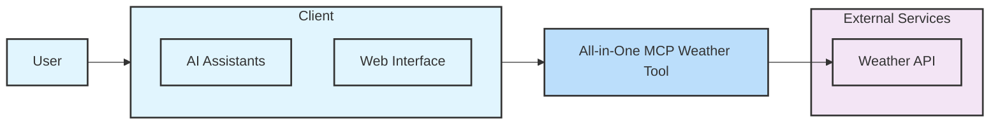
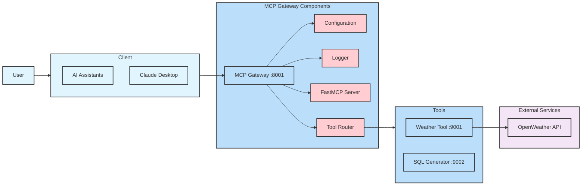

# Demo MCP

## Architecture Diagrams

### V1 Architecture (Simple All-in-One)

### V2 Architecture (Modular MCP Gateway)

## Architecture Comparison

### V1: Simple All-in-One Architecture
**Characteristics:**
- **Direct Integration**: Client communicates directly with a single weather tool
- **Monolithic Design**: All weather functionality bundled into one MCP weather tool
- **External Services**: Direct connection to external weather APIs
- **Simple Structure**: Minimal components for straightforward implementation
- **Quick Setup**: Ideal for prototypes and simple use cases

**Components:**
- User Interface (AI Assistants, Web Interface)
- All-in-One MCP Weather Tool
- External Weather API

### V2: Modular MCP Gateway Architecture
**Characteristics:**
- **Gateway Pattern**: MCP Gateway acts as middleware layer
- **Modular Design**: Separate components for different concerns
- **Tool Management**: Dispatcher service manages multiple tools
- **External Services**: Same external API integration as V1
- **Scalable Structure**: Supports multiple tools and services
- **Enterprise Ready**: Configuration, logging, and model management

**Components:**
- User Interface (AI Assistants, Web Interface)
- MCP Gateway with integrated components:
  - Configuration management
  - Logging system
  - MCP Models
  - Dispatcher Service
- Modular Weather Tool
- External Weather API

### Key Differences

| Aspect | V1 (All-in-One) | V2 (Modular Gateway) |
|--------|------------------|----------------------|
| **Complexity** | Simple, single component | Complex, multiple components |
| **Scalability** | Limited to weather functionality | Supports multiple tools |
| **Maintenance** | Monolithic updates | Independent component updates |
| **Configuration** | Built-in | Dedicated configuration service |
| **Logging** | Basic | Centralized logging system |
| **Tool Management** | Single tool | Dispatcher-managed tools |
| **Use Case** | Prototypes, simple demos | Production, enterprise systems |

### Migration Path

**From V1 to V2:**
1. Extract configuration from all-in-one tool
2. Implement MCP Gateway infrastructure
3. Add logging and monitoring capabilities
4. Refactor weather tool as modular component
5. Implement dispatcher service
6. Add support for additional tools

**When to Choose:**
- **V1**: Quick prototypes, learning MCP concepts, simple weather applications
- **V2**: Production systems, multiple tool integration, enterprise requirements