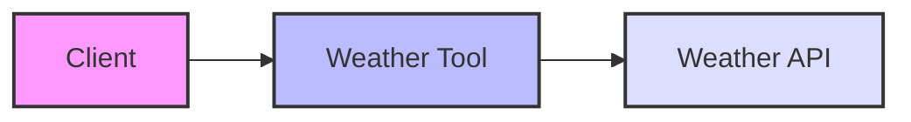
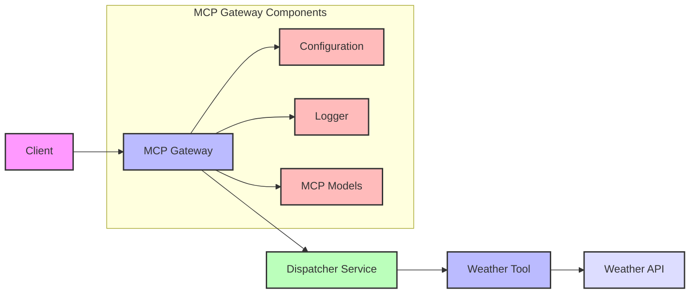

# demomcp

## Architecture Diagrams

### V1 Architecture

### V2 Architecture

### Key Differences

1. **V1 (Simple Architecture)**
   - Direct client-to-tool communication
   - Single weather tool component
   - Basic functionality without middleware

2. **V2 (MCP Architecture)**
   - Introduces MCP Gateway as middleware
   - Dispatcher service for tool management
   - Modular components (Config, Logger, Models)
   - Enhanced flexibility and scalability
   - Supports multiple tools through common interface